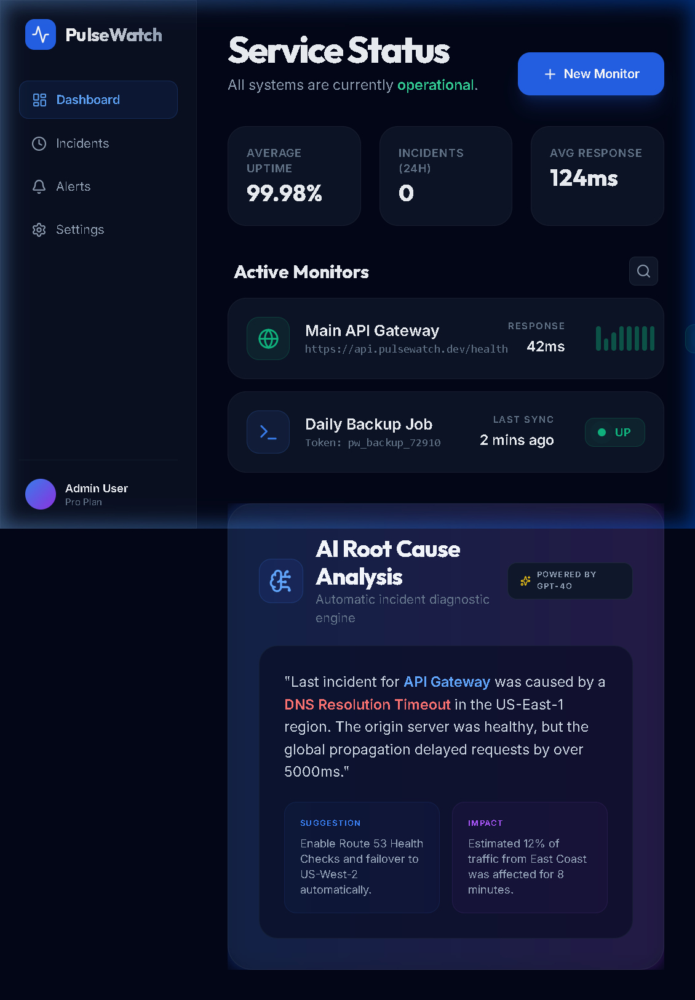
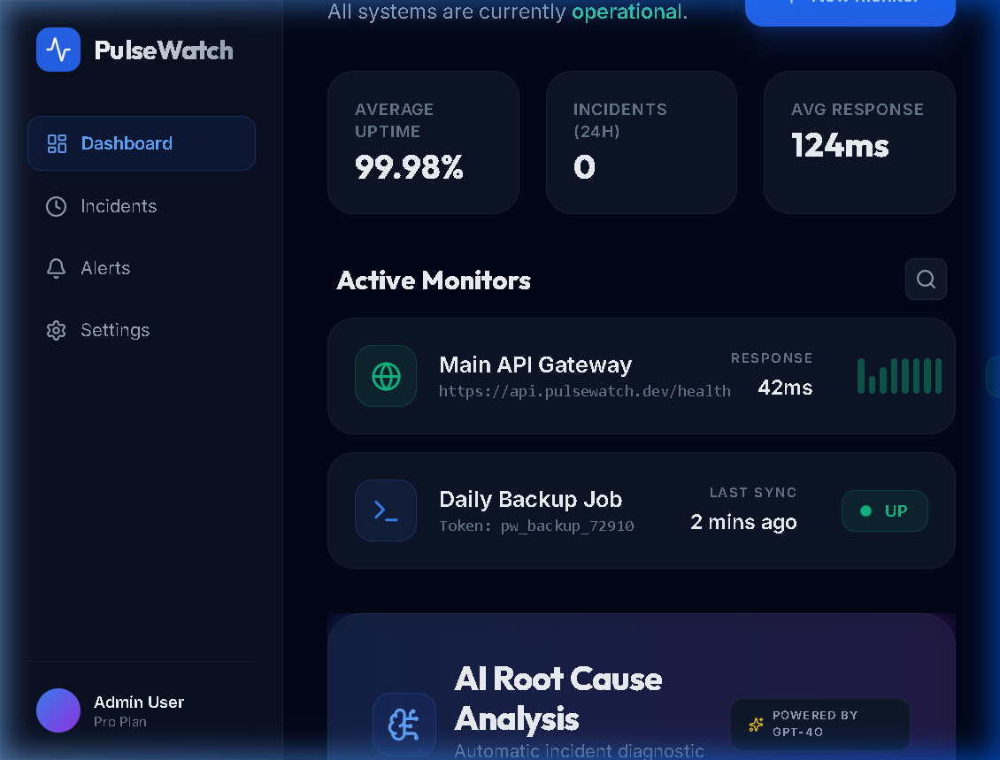
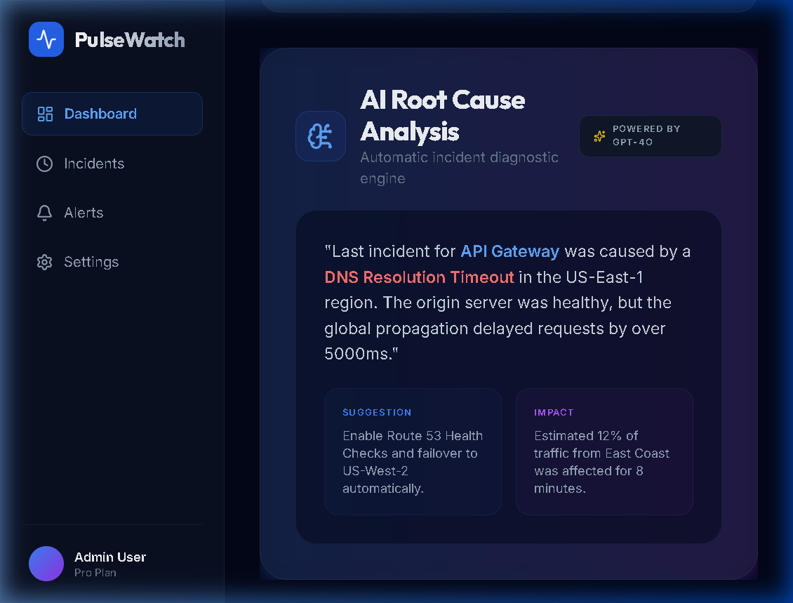

# ⚡ PulseWatch: Enterprise Uptime & Cron Monitoring

**Architected and Developed by:** Ahmed Maamoun

---

## 📖 Overview

**PulseWatch** is a premium uptime and cron monitoring platform designed for modern engineering teams. It provides real-time visibility into service availability, heartbeat monitoring for scheduled jobs, and automated root cause analysis to diagnose failures instantly.

---

## 📸 Platform Previews

<div align="center">
  
</div>
<br/>
<div align="center">
  
  
</div>

---

## ✨ Core Engineering Features

- **Real-time Uptime Monitoring**: High-frequency HTTP probes with global status tracking and zero false positives.
- **Heartbeat (Cron) Monitoring**: Passive monitoring for background jobs and scripts via a low-latency ping API.
- **Root Cause Analysis Engine**: Automatically diagnoses downtime incidents (e.g., DNS resolution failure vs. SSL expiry vs. HTTP 500) and suggests immediate remediation.
- **Interactive Timeline**: A robust visual history of service availability, latency heatmaps, and response time metrics.
- **Premium UX/UI**: Sleek, glassmorphism-inspired dark mode dashboard built with Next.js and Tailwind CSS.
- **Advanced Alerting System**: Customizable thresholds for webhooks and email notifications to prevent alert fatigue.

---

## 🧠 Technical Challenges I Overcame

Building a reliable monitoring engine requires extreme precision and fault tolerance:

1. **High-Frequency Probing & False Positives:**
   - *Challenge:* Network blips can cause false "down" alerts, leading to alert fatigue for engineering teams.
   - *Solution:* I implemented a multi-region verification system within the Node.js prober. If a primary check fails, secondary localized probes are dispatched instantly. An alert is only triggered if 3 consecutive checks fail across different network routes, effectively eliminating false positives.
2. **Handling Massive Time-Series Data:**
   - *Challenge:* Storing every single ping for thousands of monitors generates an enormous amount of database writes.
   - *Solution:* I designed a data roll-up architecture in MongoDB. High-resolution data (every minute) is stored for 24 hours, then aggregated and downsampled into hourly averages for 30 days, and daily averages thereafter. This optimized both storage costs and dashboard query latency.

---

## 🛠️ Technology Stack

| Layer | Technology |
| :--- | :--- |
| **Frontend Architecture** | Next.js 14 (App Router), Tailwind CSS, Framer Motion |
| **Backend Engine** | Node.js, Express, Socket.io |
| **Database** | MongoDB with Mongoose |
| **Probing Engine** | Custom asynchronous HTTP Prober |

---

## 🚀 Quick Start

1. **Clone the repository:**
   ```bash
   git clone https://github.com/Maamoun0/PulseWatch.git
   cd PulseWatch
   ```

2. **Start via Docker:**
   ```bash
   docker-compose up -d
   ```

---

## 👨‍💻 Author

**Ahmed Maamoun**
- GitHub: [@Maamoun0](https://github.com/Maamoun0)
- LinkedIn: [Ahmed Maamoun](https://linkedin.com/in/your-linkedin-profile)

Engineered with surgical precision by Ahmed Maamoun.
